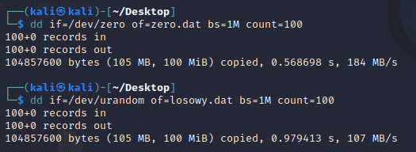
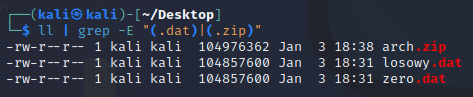
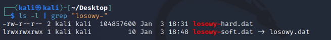

# Lab 5 - Beniamin Jankowski

## Zad 1.1

Komendy do utworzenia plików:

    dd if=/dev/zero of=zero.dat bs=1M count=100

    dd if=/dev/urandom of=losowy.dat bs=1M count=100

Komenda do spakowania:

    zip arch.zip zero.dat losowy.dat

Pliki po spakowaniu są mniejsze ponieważ nastąpiła ich kompresja, gdzie w zero.dat kompresja była bardzo skuteczna z racji na powtarzające się puste bajty.

## Zad 1.2

Powiązanie miękkie:
    
    ln -s losowy.dat losowy-soft.dat

Powiązanie twarde:
    
    ln losowy.dat losowy-hard.dat

Aby sprawdzić zajętość:

    ls -l | grep "losowy-"

Dowiązanie miękkie to wskaźnik na nazwę pliku - jeśli zniknie plik, zniknie również powiązanie. Stąd tak mała waga pliku. \
Dowiązanie twarde to tak naprawdę kopia pliku. Nawet jeśli zniknie plik, to dowiązanie twarde zostanie.

## Zad 1.3
Utwórz plik:

    dd if=/dev/zero of=pusty.dat bs=1M count=100

## Zad 1.8

    ls -Rl $1 | grep -vE "(^\.)|(t)|(^\s*$)" | sort | cut -d" " -f1 | uniq -c

